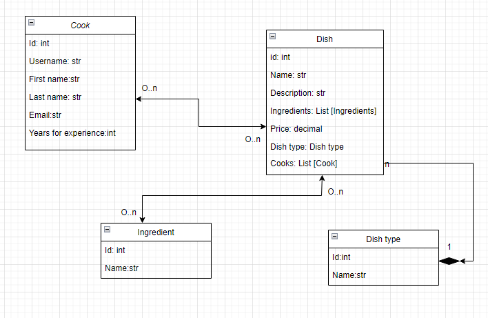
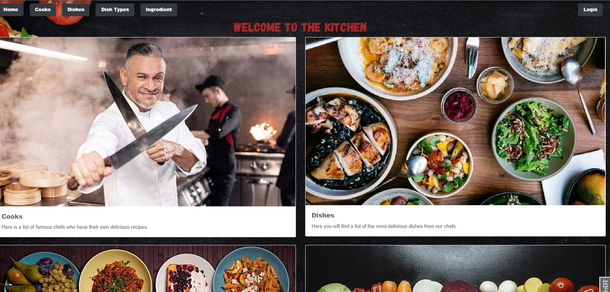
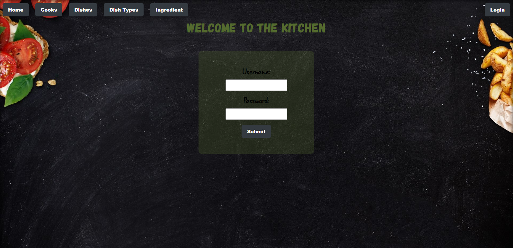
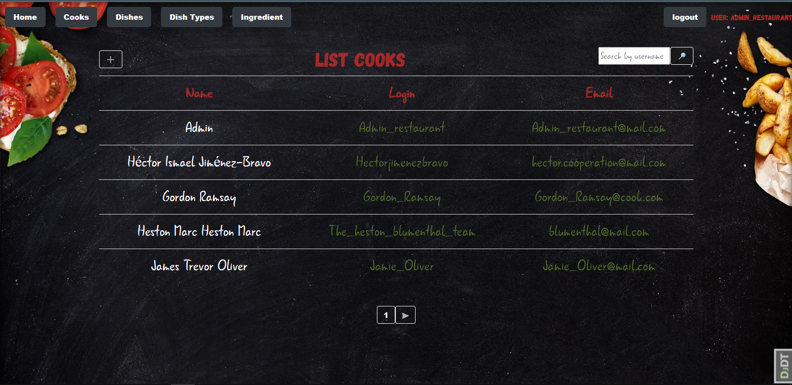
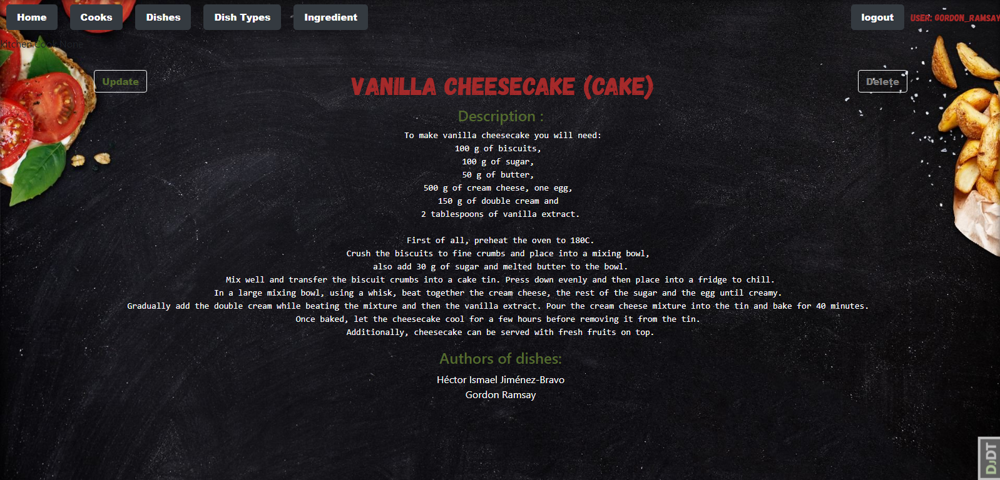
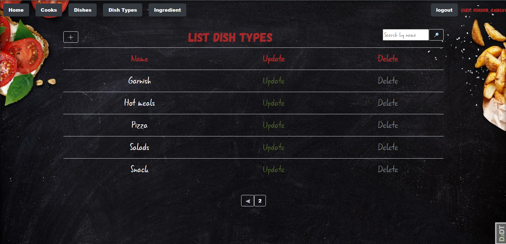
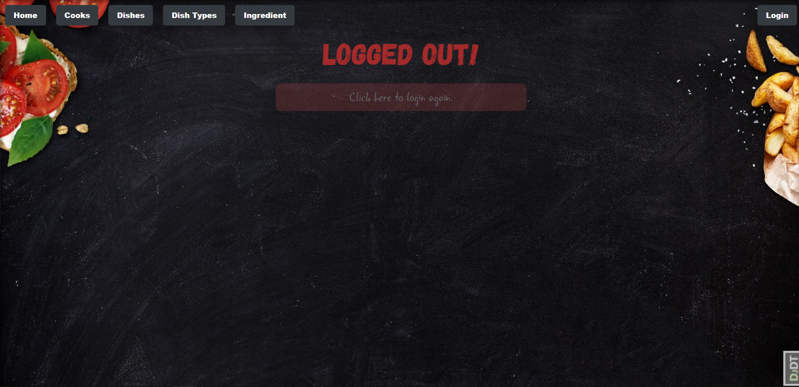

# Restaurant kitchen service

DJANGO project of the system for managing the preparation of dishes, dish types, ingredients and cooks.

## Check it out!

[Restaurant kitchen service Deploying Render ](https://restaurant-kitchen-service-awik.onrender.com)

User: Admin

Password: Pass123Pass


## Installation

```shell
git clone https://github.com/AlyonkaB/-restaurant-kitchen-service.git
cd restaurant-kitchen-service/
python -m venv venv
source venv/scripts/activate
pip install -r requirements.txt
python manage.py runserver
```

## Features

- Authentication functionality for Cook/User
- Managing Dishes, Dish types and Ingredients directly from website interface
- Powerful admin panel for advanced managing

## Demo
This site is a project structure for a kitchen with a list of chefs and their dishes.

You will have access to the list of cooks, dishes, 
types of dishes and ingredients only by logging in to the website.

DB structure:



Home page:

This page can be seen by a non-authorized user, 
but if the user wants to go to the section, 
he will be redirected to the Authorization page



Page login:

Only the Administrator can register, if you already have a login and password, 
click the login button on the top right
User: Admin
Password: Pass123Pass



Page list cook:

Сooks are users. Here we see a list of cooks,
their names and e-mails. To see more information about a particular user, 
you can click on his name and a card with detailed information will open. 
The user can edit his card and only his card.



Page detail info dish:

On the detailed information page, we can see the full description of the 
dish and the list of chefs who created this recipe. 
By clicking on the names of the chefs, you can go to see detailed information about them. 
Only the authors of the dish can update or completely delete the recipe



Page dish type/ingredients:

Users can add new ingredients and types of dishes that will be displayed by lists
in the corresponding sections. They can also be updated and deleted as needed.



Logout:

When you click the "Loguot" button, the system will log you out and redirect 
you to a page where there will be an active link to the Authorization page if necessary.


